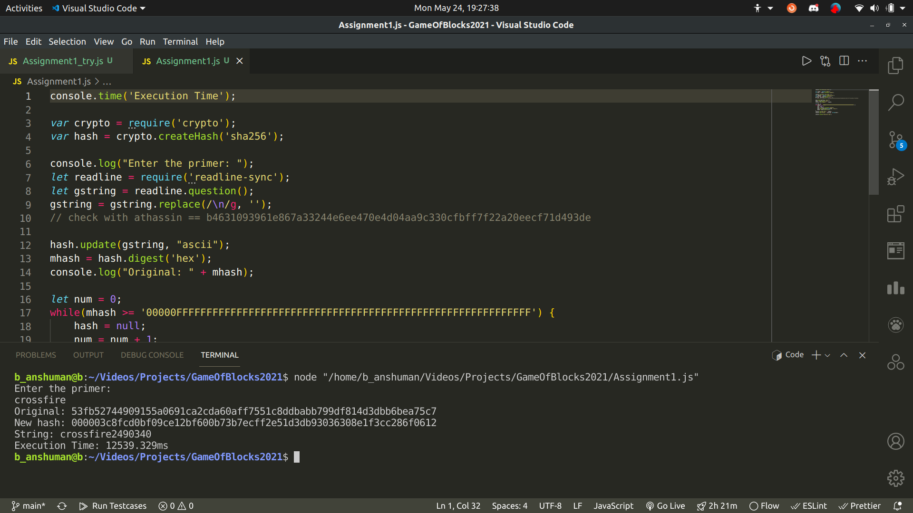

## Assignment 1

This involved finding the nounce of a string, and concatinating a number and rechecking the nounce to get it below a required value.  
Implemented with the help of `node` and using `crypto` library of Js.

