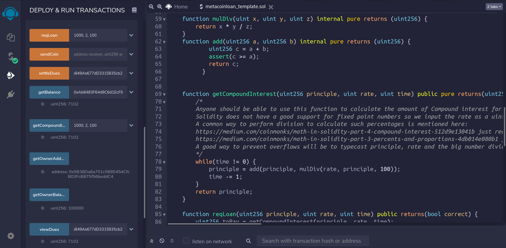

# Assignment 2

Implemetation of a basic set of contracts on <a href="http://remix.ethereum.org">REMIX IDE</a>.  
Task was to initialise an entity 'Owner' with 1,00,000 credits, or _Meta Coins_ (the name of token implemented), who has acquired this many credits by taking loans from multiple users/addresses.  

## Contract MetaCoin

This Contract(Class) defines our currency. Includes the functions `sendCoin` and `getCoin`.

## Contract Loan

A smart contract, that includes functions:

<ul>
<li> getCompoundInterest (pure) - returns an approximate value of compound interest given P, R, T.</li>
<li> getOwnerBalance (view) - returns Owner's balance, and is accessible by all.</li>
<li> reqLoan (none) - to request repayment of loan taken by the Owner, by specifying P, R, T and is broadcasted.</li>
</ul>

that can be accessed by all entities in the system,  
and the functions: `viewDues` (view), `settleDues` (none)

<ul>
<li> viewDues (view) - to view Dues of a particular creditor.</li>
<li> settleDues (none) - to settle Dues with that creditor provided Owner has enough balance.</li>
</ul>

accessible only by the owner, to settle his debt. 
Two more auxiliary functions used were:

<ul>
<li> add (pure) - to add more securely.</li>
<li> mulDiv (pure) - to implement this arithmetic more securely.</li>
</ul>
 

These contracts can be easily run on <a href="http://remix.ethereum.org">REMIX</a> by deploying on a JavaScript Virtual Machine, with default parameters being enough to get started.

---

## Summary

Take a scenario in which address `0x5B38Da6a701c568545dCfcB03FcB875f56beddC4` is the owner and `0xAb8483F64d9C6d1EcF9b849Ae677dD3315835cb2` is the creditor.  
Deploying the _Loans_ contract initiated the current active address as the owner, with the above number of tokens via the constructor of _MetaCoin_ contract. The creditor then requested for repayment via `reqLoan` function, which was then viewed by the owner, and settled through `viewDues` and `settleDues` respectively.  
 

Following is the screenshot of the above scenario.  

---

## A Subtle Warning

The Compound Interest Implementation in these contracts is inherently flawed.  
This is because of the fact that Solidity at its current stage, doesn't support floating-point numbers.  
Therefore though acceptable for large transactions, for smaller values, value returned by `getCompoundInterest` function malfunctions.  
This can be avoided by implementing another algorithm for Compound Interest calculation.  
Example of error-prone inputs:

> getCompoundInterest: 10, 2, 100

would return 10, as though no interest has been applied.

> getCompoundInterest: 100, 2, 10

would return 120, just as though of a simple interest calculation.
This is occuring because of neglecting the small increase of principle per iteration.
